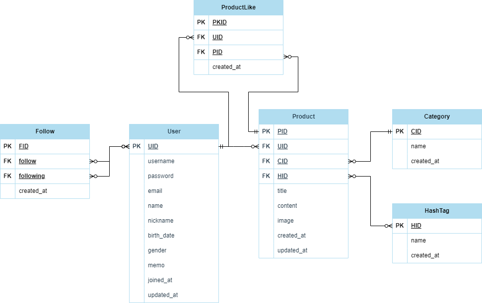

# spartamarket_DRF
## 프로젝트 소개
    - 중고 마켓의 결제 전까지의 상태를 DRF로 젝작
## 프로젝트 기능
    - 회원가입
        - 조건: username, 비밀번호, 이메일, 이름, 닉네임, 생일 필수 입력하며 성별, 자기소개 생략 가능
        - 검증: username과 이메일은 유일해야 하며, 이메일 중복 검증(선택 기능).
        - 구현: 데이터 검증 후 저장.

    - 로그인
        - 조건: 사용자명과 비밀번호 입력 필요.
        - 검증: 사용자명과 비밀번호가 데이터베이스의 기록과 일치해야 함.
        - 구현: 성공적인 로그인 시 토큰을 발급하고, 실패 시 적절한 에러 메시지를 반환.

    - 프로필 조회
        - 조건: 로그인 상태 필요.
        - 검증: 로그인 한 사용자만 프로필 조회 가능
        - 구현: 로그인한 사용자의 정보를 JSON 형태로 반환.

    - 상품 등록
        - 조건: 로그인 상태, 제목과 내용, 상품 이미지 입력 필요.
        - 구현: 새 게시글 생성 및 데이터베이스 저장.

    - 상품 목록 조회
        - 조건: 로그인 상태 불필요.
        - 구현: 모든 상품 목록 페이지네이션으로 반환.

    - 상품 수정
        - 조건: 로그인 상태, 수정 권한 있는 사용자(게시글 작성자)만 가능.
        - 검증: 요청자가 게시글의 작성자와 일치하는지 확인.
        - 구현: 입력된 정보로 기존 상품 정보를 업데이트.

    - 상품 삭제
        - 조건: 로그인 상태, 삭제 권한 있는 사용자(게시글 작성자)만 가능.
        - 검증: 요청자가 게시글의 작성자와 일치하는지 확인.
        - 구현: 해당 상품을 데이터베이스에서 삭제.

## ERD

## 개발 기간
    2024-08-31 ~
## 개발 환경 및 사용 기술
    IDE : VSCODE
    Windows 10
    Python 3.10.14
    pillow 10.4.0
    Django 4.2
    django-seed 0.3.1 
    djangorestframework 3.15.2 
    
## API
    |순서|메소드|url|상태|설명|
    |--|----|---------|---------|---------|